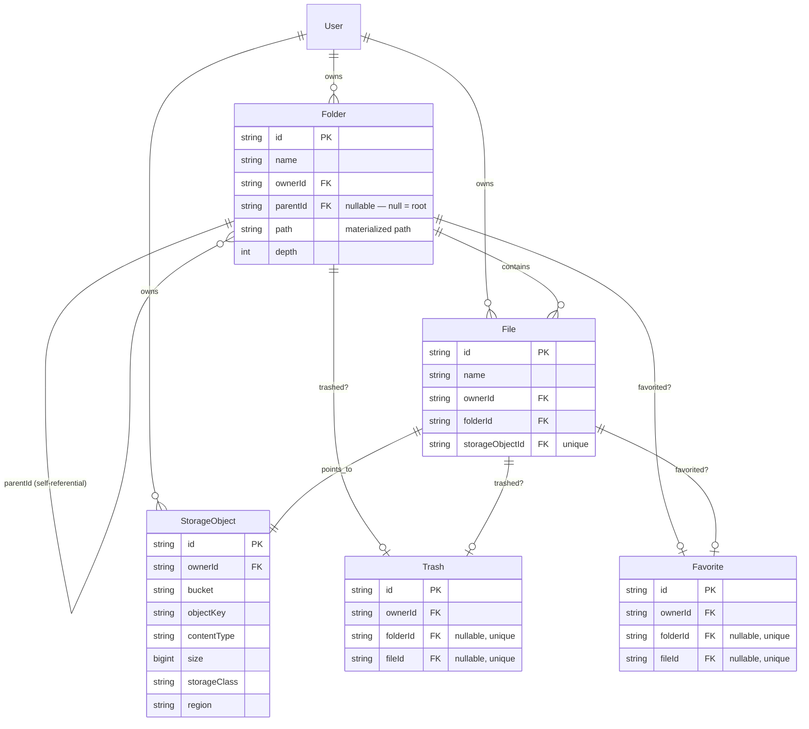

# Core Drive Data Model

Covers the schema introduced in Milestone 2: `Folder`, `File`, `StorageObject`, `Trash`,
`Favorite`. See [ROADMAP.md](../ROADMAP.md) for the milestone's full scope.

## Why Folder / File / StorageObject are three separate tables

- **`StorageObject`** is the only table that knows anything about where bytes actually live
  (bucket, object key, checksum, content type, size, storage class, encryption status). It never
  contains the bytes themselves — those live in S3 (Milestone 3+; today these are stub rows
  proving the model, not real uploads).
- **`File`** is a Drive-facing concept: a name, an owner, a parent folder, and a pointer
  (`storageObjectId`) to exactly one `StorageObject`. This separation is what makes Milestone 6's
  version history possible later — a `FileVersion` will point at a *different* `StorageObject`
  for the same `File`, without ever duplicating the "what folder is this in" concern.
- **`Folder`** never touches storage at all — it's pure hierarchy.

Binary data has no path into Postgres anywhere in this model. If you ever see a migration adding
a `bytea`/`blob` column here, that's a bug.

## Folder hierarchy: materialized path

Every `Folder` has:
- `parentId` — nullable; `NULL` means "this is a user's root folder." A partial unique index
  (`Folder_ownerId_root_key`, `WHERE "parentId" IS NULL`) guarantees at most one root per owner
  at the database level, not just in application code.
- `path` — the ancestor chain as slash-delimited ids, e.g. `/rootId/photosId/` for a folder two
  levels deep. The folder's own id is *not* included in its own `path`.
- `depth` — `path`'s segment count, purely for display/sorting convenience.

This was chosen over a closure table (the roadmap's other option) because breadcrumb resolution
— the operation Milestone 2 actually needs — is a single string split plus one `WHERE id IN
(...)` query with a materialized path, versus a join-heavy closure-table query. The tradeoff:
moving a subtree (Milestone 5) will need to rewrite `path`/`depth` on every descendant, since
there's no closure table doing that bookkeeping automatically. That's an accepted cost — Milestone
5 is explicitly where move/copy/recursive-delete get built, and a batched path-rewrite on move is
a well-understood, boring operation.

Root-folder creation is **lazy**: `GET /folders/root` creates one on first call if it doesn't
exist yet, the same pattern used for lazily syncing a `User` row from Clerk in Milestone 1. There
is no "on signup, create a root folder" hook to keep in sync with the auth provider.

## Cursor pagination

Folder-children and file-listing queries use keyset (cursor) pagination, not offset pagination:
`ORDER BY name ASC, id ASC`, fetch `limit + 1` rows, and if that extra row exists, derive
`nextCursor` from the last *kept* row's `id` (see `common/pagination/cursor-page.ts`). Prisma's
`cursor: { id }` + `skip: 1` combined with a fully-deterministic `orderBy` (name, then id as a
tiebreaker) produces correct keyset pagination even when many folders/files share a name.

This was benchmarked against 10,000 synthetic files in a single folder (seed script,
`SEED_BULK=true`) — `EXPLAIN ANALYZE` shows ~3ms execution time for a page fetch. At this row
count Postgres's planner prefers a sequential scan over the `File_ownerId_folderId_idx` index
(cheaper for a table this size); a composite index matching the full `ORDER BY` would start
mattering at a much larger scale and isn't worth adding speculatively yet.

## Ownership and Trash/Favorite

Every table scoped to a user carries `ownerId` directly (no org/workspace scoping yet — that's
Milestone 10). Every use case fetches-and-checks ownership before acting; a resource that exists
but belongs to someone else 404s rather than 403s, to avoid leaking existence.

`Trash` and `Favorite` are marker tables, not a `deletedAt`/`isFavorite` column on `Folder`/
`File`. Existence of a row = the thing is trashed/favorited. Each has a `folderId`/`fileId` pair
where exactly one must be set — enforced by a `CHECK` constraint
(`Trash_exactly_one_target`, `Favorite_exactly_one_target`), not just application logic. Neither
table has real behavior wired up yet — that's Milestone 6 (Trash) and Milestone 2's schema is
just reserving the shape the roadmap specified.

## Entity relationship diagram

